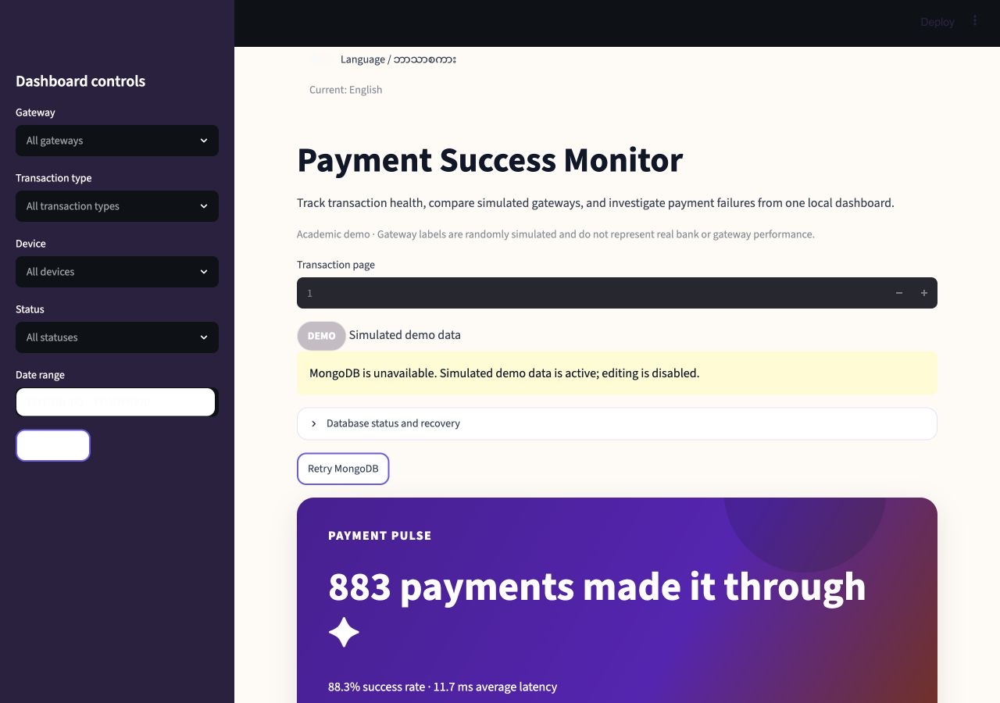
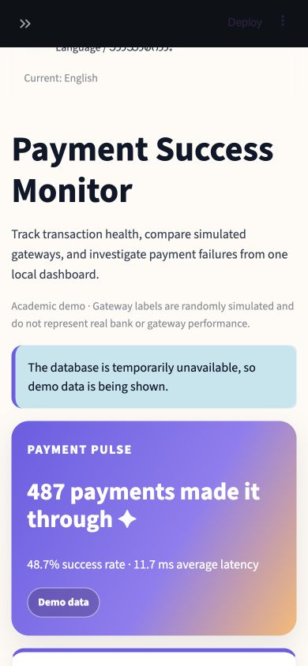

# Synthetic Payment Routing Optimization Dashboard

A local Streamlit application that assigns transactions to synthetic gateway
alternatives using constrained mixed-integer optimization and compares the
result with random, round-robin, static, and greedy routing policies.

This is an academic MVP built from a Kaggle transaction dataset. Gateway A-D
labels and the dashboard's payment outcomes are generated by a controlled,
fixed-seed simulation. The original outcome is retained separately as
`Source Transaction Status`; dashboard metrics use the generated
`Transaction Status`. All gateway and success-rate results are synthetic and
must not be interpreted as measurements of real banks or payment gateways.

The optimization benchmark adds synthetic gateway fees, latency, eligibility,
capacity, incidents, and counterfactual outcomes. It targets an approximate
chronological 60/20/20 split while keeping complete UTC hourly buckets intact,
and keeps evaluation outcomes hidden until routing decisions are fixed. Data
with fewer than three distinct hourly buckets is reported as unsuitable instead
of being split or evaluated. See [the dataset card](docs/data-card.md) for
provenance and limitations.

## Features

- Capacity- and eligibility-constrained gateway allocation using SciPy MILP
- Comparisons with four routing baselines on an untouched chronological period
- Explicit success, fee, latency, utilization, and expected-utility tradeoffs
- Deterministic, versioned candidate routes and separately held outcomes
- Reproducible Gateway A-D assignment
- Strict CSV schema and value validation
- Overall and gateway-level payment success metrics
- Interactive filters for gateway, transaction type, device, status, and date
- Server-side paginated transaction history
- Latest-50 active-history gateway monitoring
- Alerts for drops of at least 10 percentage points below baseline
- Top-of-page English/မြန်မာ language switch
- Button-triggered AI Operations Brief in the active dashboard language,
  generated with MiMo 2.5 Pro
- Interactive Plotly charts and recent-transaction investigation
- MongoDB Atlas document storage with public read-only analytics
- Hashed-password administrator login with create, edit, and soft-delete controls
- Indexed MongoDB queries and transaction audit records

## Dashboard previews

| Desktop dashboard | Mobile dashboard |
| --- | --- |
|  |  |

## Requirements

- Python 3.11 or newer
- [uv](https://docs.astral.sh/uv/) for locked, reproducible environments
- Access to an Anthropic-compatible MiMo 2.5 Pro endpoint
- The source file `transaction_data.csv`
- A MongoDB Atlas project for client-server database mode

## Setup

From the project directory:

```bash
make setup
mkdir -p data/raw data/processed
cp /path/to/transaction_data.csv data/raw/transaction_data.csv
```

`make setup` creates `.venv` from the committed lock and installs the project
and development tools as an editable package. The equivalent manual install is:

```bash
uv sync --extra dev --frozen
```

The CSV files under `data/raw/` and `data/processed/` are intentionally ignored
by Git.

### Configure the optional AI brief

Set the Anthropic-compatible endpoint and API key in the shell that starts
Streamlit. The model defaults to `mimo-2.5-pro`:

```bash
export ANTHROPIC_BASE_URL=https://your-provider.example
export ANTHROPIC_API_KEY=replace-with-your-api-key
export ANTHROPIC_MODEL=mimo-2.5-pro
```

Do not commit your real API key. Only aggregate metrics are sent to the model.
Raw transaction rows,
transaction IDs, timestamps, and individual amounts are excluded.

### Configure MongoDB Atlas

Follow [docs/mongodb-atlas-setup.md](docs/mongodb-atlas-setup.md) to create the
cluster and database user, generate an administrator password hash, import the
simulated dataset, and configure Streamlit secrets. Without Atlas, the app remains
usable in read-only CSV/demo fallback mode.

## Prepare the dataset

Generate the gateway-enriched dataset:

```bash
make prepare
```

The command:

1. Validates the source schema and values.
2. Sorts transactions chronologically.
3. Copies each original outcome to `Source Transaction Status`.
4. Assigns Gateway A-D and generates dashboard `Transaction Status` values with
   a reproducible seed. Success probabilities combine controlled gateway base
   rates with device, transaction-type, time-of-day, and amount adjustments,
   then clip the result to documented simulation bounds.
5. Writes a separate processed CSV.

The controlled base success probabilities are 94% (Gateway A), 91% (B), 88%
(C), and 85% (D). Adjustments are: Mobile −1.5 points; Deposit +1 point,
Transfer −1 point, Withdrawal −2 points; 00:00–05:59 UTC −2.5 points;
09:00–17:59 UTC +0.5 points; amounts over 500 up to 1,000 −1 point; and
amounts over 1,000 −2 points. Final probabilities are clipped to 55%–99%
before the fixed-seed draw. These are academic assumptions, not observed
payment behavior.

## Run the tests

```bash
make test
```

`make test` is offline by default. The Atlas and AI-provider checks are skipped
unless explicitly enabled, so they never read credentials or make network calls
in the normal suite.

### Optional external verification

After configuring Atlas and the AI provider in your shell, run the bounded live
contracts explicitly:

```bash
export MONGODB_TEST_DATABASE=payments_contract_test
export MONGODB_TEST_COLLECTION=dashboard_contract_test
RUN_ATLAS_TESTS=1 .venv/bin/pytest tests/test_live_atlas.py -q
RUN_AI_TESTS=1 .venv/bin/pytest tests/test_live_ai.py -q
# Or run both after configuring both services:
make test-live
```

The Atlas contract requires dedicated database and collection names with a
separate `test` segment; it refuses the configured `MONGODB_DATABASE` value and
never falls back to the production `transactions` collection. Use read-only
credentials for this aggregate query.
The AI contract uses a 10-second timeout, one provider attempt, and a 128-token
output cap. It checks only that the provider returns a validated, aggregate-only
brief. The dashboard normally falls back to a deterministic local brief if the
provider is missing, unavailable, or returns invalid content.

For a real browser smoke check, install Chromium once, start the dashboard, and
pass its URL explicitly:

```bash
.venv/bin/python -m playwright install chromium
ARROW_DEFAULT_MEMORY_POOL=system make run
DASHBOARD_URL=http://localhost:8501 make smoke
```

The smoke check uses headless Chromium and fails on a load error, a missing
visible source badge or core KPI labels, or a rendered Streamlit exception.
It is intentionally separate from the default test suite.

## Start the web app

```bash
ARROW_DEFAULT_MEMORY_POOL=system make run
```

Open [http://localhost:8501](http://localhost:8501) if the browser does not open
automatically. Stop the server with `Ctrl+C`.

## Use the dashboard

1. Use the English/မြန်မာ switch above the title to choose the dashboard
   language. Gateway names and transaction category values remain unchanged.
2. Use sidebar filters to narrow the displayed KPIs, charts, and transaction
   table.
3. Click **Generate AI Brief** for a summary of the current filtered view in the
   active dashboard language. The output is retained until the underlying
   metrics or language change. Switching languages invalidates the previous
   brief, so generate a new one after the switch.
4. Expand **Evidence sent to the AI model** to compare the generated text
   with the exact aggregate facts supplied to MiMo.
5. Review Gateway Health to compare each baseline with its latest 50 active
   transactions.
6. Use Failure Analysis to investigate patterns by latency band.
7. Use Recent Transactions to inspect individual records. The table is a
   bounded server-side page; use the Previous and Next controls to navigate,
   and changing repository filters returns to page 1.
8. The administrator can expand **Administrator transaction manager**, enter the
   configured password, and create, edit, or soft-delete simulated records.

The AI brief follows the active dashboard language, uses simulated gateway data,
and is not real financial or routing advice. If configuration is missing or the
provider is unavailable, the dashboard uses a deterministic local fallback
without exposing the key.

Display filters do not change alert calculations. Alerts always use the
full active transaction history.

## Metric definitions

- **Success rate:** Successful transactions divided by all transactions in the
  current display scope.
- **Gateway baseline:** A gateway's success rate across at least 200 active
  attempts strictly earlier than the latest-50 monitoring window.
- **Rolling rate:** Success rate across the latest 50 active transactions for
  one gateway.
- **Drop:** Gateway baseline minus its rolling rate.
- **Alert:** A drop of at least 10 percentage points.
- **Insufficient history:** Fewer than 50 recent attempts or fewer than 200
  strictly earlier reference attempts for a gateway.
- **Average latency:** Mean transaction latency in milliseconds.
- **P95 latency:** The latency value at or below which 95% of transactions fall.

Every success, failure, baseline, rolling-rate, and alert metric above is based
on the controlled synthetic `Transaction Status`, not the source dataset's
original outcome.

## Project structure

```text
payment_dashboard/
├── alerting.py       # Baselines and rolling alert evaluation
├── analytics.py      # Metrics, filtering, breakdowns, and time series
├── app.py            # Streamlit web interface
├── admin_auth.py     # Hashed administrator password verification
├── mongodb.py        # Atlas reads, indexes, and DataFrame mapping
├── data_loader.py    # Schema validation and typed loading
├── load_mongodb.py   # Local validated Atlas importer
├── prepare_data.py   # Reproducible gateway enrichment command
└── transaction_service.py # Validated admin mutations

tests/
├── conftest.py
├── test_alerting.py
├── test_analytics.py
├── test_app.py
├── test_data_loader.py
└── test_prepare_data.py
```

## Troubleshooting

### Prepared data is missing

Run the preparation command again and confirm this file exists:

```text
data/processed/transactions_with_gateways.csv
```

### A gateway shows insufficient history

Import or create enough active transactions for that gateway to reach 50 rows.

### The local port is already in use

Choose another port:

```bash
.venv/bin/python -m streamlit run payment_dashboard/app.py --server.port 8502
```

## Limitations

- Gateway assignments and dashboard outcomes use a fixed-seed controlled
  simulation and do not describe real gateway performance.
- The dashboard reads stored historical transactions; it is not a production
  streaming pipeline.
- The application does not connect to banks, payment APIs, or external
  alert-delivery services. Its MongoDB records remain simulated academic data.
- The dataset has no explicit insufficient-balance, incorrect PIN, or incorrect
  OTP failure-reason fields.
- The application is designed for local academic demonstration, not production
  operations.

For support interpretation, see
[docs/customer-support-guide.md](docs/customer-support-guide.md).
