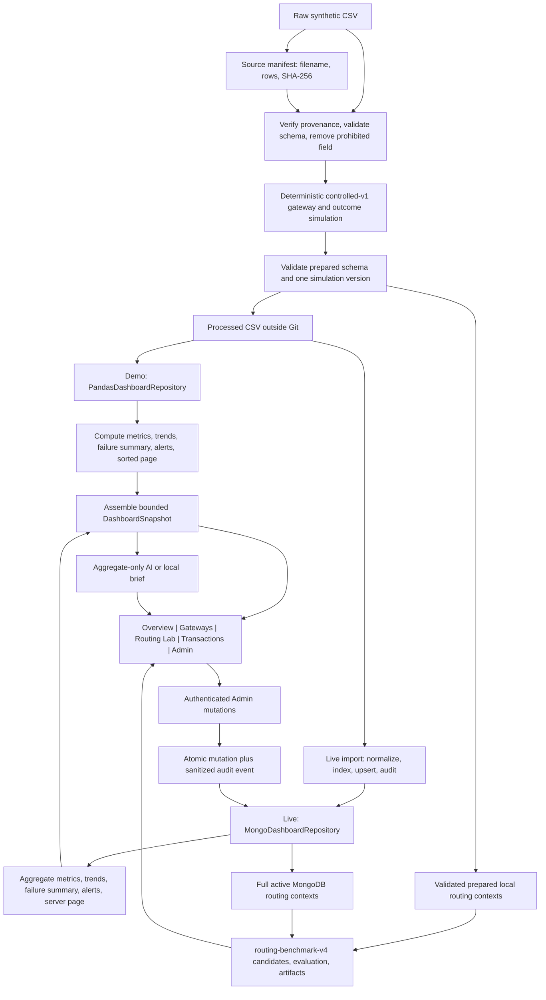

# Payment Success Rate Optimization: Project Function and Dataset Guide

## 1. Project overview

This repository is a **data analysis and management** project for an academic
payment-operations scenario. It manages a traceable transaction dataset,
validates and transforms it reproducibly, offers demo and MongoDB access paths,
calculates operational evidence, and presents that evidence in a Streamlit
dashboard. It is intended for learners, project judges, analysts, and operators
who need to understand both what the dashboard says and how the data reached it.

The project has three deliberately separate kinds of work:

- **Descriptive analytics** summarize the current display scope: transaction
  volume, success and failure counts, latency, gateway comparisons, trends, and
  failure patterns.
- **Data management** protects provenance, validates schemas, separates public
  and private fields, normalizes MongoDB records, bounds interactive reads,
  records simulation lineage, and audits authorized changes.
- **Synthetic routing evaluation** compares five routing policies under
  hand-authored gateway assumptions. This is a reproducible, non-causal
  experiment—not evidence about real banks, processors, outages, or future
  production performance.

The source contains synthetic transaction contexts. Gateway A–D assignments,
dashboard outcomes, gateway states, costs, capacities, counterfactual outcomes,
and routing recommendations are also synthetic. See the [dataset
card](data-card.md) for provenance and limitations.

## 2. Dashboard tour

The dashboard has an English/မြန်မာ language switch and five top-level views.
The source badge tells you whether the current snapshot is live MongoDB data or
a read-only demo fallback and shows its simulation version.

| View | Question it answers | Evidence to inspect |
| --- | --- | --- |
| **Overview** | “What is happening now?” | Four KPIs, the success-rate trend, compact gateway health, recent transactions, and an optional AI Operations Brief. |
| **Gateways** | “Which synthetic gateways or failure patterns deserve attention?” | Gateway volume, success and latency comparisons; failures by latency band; and full alert evidence including counts, periods, confidence interval, and status. |
| **Routing Lab** | “How do routing policies compare inside the simulator?” | Assumptions, run ID and input digest, selected objective weights, policy results, constraints, utilization, uncertainty, and sensitivity evidence. |
| **Transactions** | “Which records make up the selected result?” | A newest-first, paginated table and its interpretation guide. Previous/Next move through bounded pages. |
| **Admin** | “Can an authorized operator manage the live simulated dataset?” | Shared-demo authentication plus validated create, edit, and soft-delete controls. Demo mode is read-only. |

Overview, Gateways, and Transactions share filters for gateway, transaction
type, device, status, and date. Those filters change displayed KPIs, charts,
and transaction rows. They do **not** change alerts: alert calculations use the
full active history so a display filter cannot manufacture a degradation.
Routing Lab likewise ignores display filters and pagination because it needs a
complete fixed context. Admin is isolated from analytical filters and KPI
cards.

Pagination implementation differs by backend: pandas slices a sorted in-memory
frame, while MongoDB performs server-side pagination. Both return the same
bounded page fields to the presentation layer.

The AI brief is generated only when requested. It receives aggregate snapshot
facts—counts, rates, gateway aggregates, active-alert names, a top failure band,
source, and simulation version—not raw transaction rows or individual payment
details. If the configured provider is missing, unavailable, or returns invalid
content, the application uses a deterministic local brief. The displayed brief
is analysis of synthetic evidence, not financial or routing advice.

## 3. Dataset lifecycle

The operational dashboard lifecycle branches into a local pandas path and a
live MongoDB path, but both paths return the same bounded `DashboardSnapshot`
contract. Routing uses validated transaction contexts from the corresponding
backend through a separate read boundary; it does not use snapshot aggregates.

In order:

1. The [source manifest](../data/source-manifest.json) records the expected
   source filename, 1,000-row count, retrieval date, license, and SHA-256
   digest. Preparation refuses a mismatched filename, row count, or checksum;
   the raw file is not committed.
2. [`prepare_data.py`](../payment_dashboard/prepare_data.py) verifies that
   manifest, then [`data_loader.py`](../payment_dashboard/data_loader.py)
   validates required fields, unique nonblank IDs, categories, booleans,
   timestamps, and finite non-negative numeric values.
3. [`simulation.py`](../payment_dashboard/simulation.py) sorts stably, uses a
   fixed seed, assigns Gateway A–D, preserves the original outcome in `Source
   Transaction Status`, produces the dashboard `Transaction Status`, and adds
   `Simulation Version = controlled-v1`.
4. Prepared validation requires a known gateway and exactly one nonblank
   simulation version. Preparation also checks that row count and preserved
   source outcomes did not change before writing a separate processed CSV.
5. Demo mode loads the validated frame into pandas. Live setup uses
   [`load_mongodb.py`](../payment_dashboard/load_mongodb.py) to normalize and
   synchronize it into MongoDB, create indexes, preserve soft deletions, and
   audit inserts and updates.
6. Each repository computes metrics, trends, failure summary, alerts, and
   transaction page data before assembling `DashboardSnapshot` as the
   presentation contract. Pandas applies the analytical functions to a sorted
   in-memory frame; MongoDB runs equivalent aggregate and page queries. If
   MongoDB is unconfigured or unavailable, the app clearly labels a read-only
   demo fallback.
7. The assembled snapshot feeds the five-view presentation and aggregate-only
   AI brief. Routing Lab reads transaction contexts through a separate
   boundary: the validated prepared local/demo frame for the pandas path, or
   the full active MongoDB routing context for the live path. It does not
   consume `DashboardSnapshot` aggregates.
8. The five views render those governed outputs without performing analytical
   calculations themselves.
9. In live mode only, an authenticated Admin mutation is validated and written
   together with a sanitized audit record. Soft-deleted rows remain stored but
   are excluded from active analytics.

## 4. Dataset fields and management controls

### Field groups

| Group | Representative fields | Purpose and control |
| --- | --- | --- |
| Source transaction context | `Transaction ID`, sender and receiver account IDs, `Transaction Amount`, `Transaction Type`, `Timestamp`, source status, `Fraud Flag`, geolocation, device, network slice, latency, bandwidth | Required schema is validated before use. Account identifiers are retained only where management workflows need them; public MongoDB projections and routing artifacts exclude them. No account values are reproduced in this guide. |
| Controlled dashboard simulation | `Bank Gateway`, generated `Transaction Status`, preserved `Source Transaction Status` | Gateway and displayed outcome are derived, never claimed as observed processor behavior. The fixed seed and stable ordering make preparation reproducible. |
| Lineage and lifecycle metadata | `Simulation Version`, `is_deleted`, created/updated/deleted timestamps and actor labels | Lineage prevents incompatible simulations from being silently combined. Lifecycle metadata supports active-row queries, soft deletion, and accountability. |
| Routing contexts and candidates | source and benchmark timestamps, transaction ID, amount, type, device, gateway ID, eligibility, availability, capacity, expected success, fee, latency, operational state | The persisted context is deliberately minimized. Account identifiers and unrelated dashboard fields are not routing inputs or run artifacts. |
| Routing outcomes and reports | keyed `realized_success`, policy metrics, decisions, split boundaries, selected weights, confidence intervals, constraints, sensitivity evidence | Potential outcomes remain separate until a policy has fixed its decisions. Reports disclose the run source, version, and evidence boundaries. |

The loader immediately discards the source’s `PIN Code` column before
validation returns data to preparation. Prepared CSVs, public projections,
routing contexts, AI inputs, forms, and audit snapshots do not carry that
field. Audit sanitization also removes account identifiers and database-private
IDs. Generated CSVs and routing-run directories stay outside the committed
source tree.

### Integrity, lineage, and storage

- **Provenance:** the manifest check binds the raw file to its filename, row
  count, and content digest. Processed data is derived; it does not replace the
  immutable source contract.
- **Validation:** raw and prepared schemas are separate. Populated prepared data
  must contain exactly one nonblank `Simulation Version`; unknown gateways,
  mixed versions, invalid types, duplicate IDs, and unsafe numeric or timestamp
  values are rejected rather than repaired silently.
- **Versions:** prepared dashboard simulation is `controlled-v1`; routing
  evidence is `routing-benchmark-v4`; create or edit operations mark the row
  `manual-v1`. A live collection containing more than one active simulation
  version is rejected rather than silently pooled under the first label. An
  operator must therefore keep each analyzed snapshot on one coherent lineage.
- **MongoDB normalization:** display names are mapped to stable storage names;
  reads use active rows, server-side aggregation, explicit public projection,
  deterministic sorting, and pages limited to 1–100 rows. The dashboard does
  not create indexes during an interactive read; the importer owns that task.
- **Import behavior:** a rerun upserts matching active records, inserts missing
  ones, preserves previously soft-deleted matches, leaves database records that
  are absent from the import unchanged, and writes import audit events.
- **Admin governance:** password verification uses a stored salted hash and
  constant-time comparison. Failed attempts are throttled in MongoDB. Create,
  update, or soft-delete and its audit event run in one database transaction
  when sessions are available; failures are translated without leaking
  provider details.
- **Routing artifact checksum consistency:** [`routing_run_store.py`](../payment_dashboard/routing_run_store.py)
  writes minimized contexts, candidates, held outcomes, report, configuration,
  and per-artifact digests under a content-derived run ID. Loading recomputes
  the digests and compares them with the unsigned mutable manifest. This
  checksum consistency verification detects artifact/manifest inconsistency or
  accidental corruption. Changing both an artifact and its unsigned mutable
  manifest can pass this check. It does not provide authenticated integrity or
  nonrepudiation.

## 5. Functional architecture

The code is organized around responsibilities rather than the Streamlit page.
The important entry points and contracts are:

| Responsibility | Load-bearing functions and contracts | Why it matters |
| --- | --- | --- |
| Preparation and validation | `verify_source_manifest()` and `prepare_file()` in [`prepare_data.py`](../payment_dashboard/prepare_data.py); `validate_raw_transactions()`, `validate_prepared_transactions()`, and `load_transactions()` in [`data_loader.py`](../payment_dashboard/data_loader.py); `simulate_transactions()` in [`simulation.py`](../payment_dashboard/simulation.py) | Turns a verified source into a typed, deterministic, versioned analytical dataset while preserving the original outcome separately. |
| Repository contract | `DashboardRepository.fetch()`, `DashboardFilters`, `PageRequest`, and `PandasDashboardRepository.fetch()` in [`dashboard_repository.py`](../payment_dashboard/dashboard_repository.py); `MongoDashboardRepository.fetch()` in [`mongodb.py`](../payment_dashboard/mongodb.py) | Both storage paths produce one `DashboardSnapshot`: metrics, gateway summary, trend, failures, alerts, one page, total count, source, and simulation version. This keeps presentation independent of storage. |
| Analytics and alerts | `summary_metrics()`, `gateway_summary()`, `failure_breakdown()`, `success_rate_series()`, and `apply_filters()` in [`analytics.py`](../payment_dashboard/analytics.py); `difference_of_proportions_interval()` and `evaluate_alerts()` in [`alerting.py`](../payment_dashboard/alerting.py); thresholds in [`config.py`](../payment_dashboard/config.py) | Separates deterministic calculations from rendering and ensures monitoring uses full active history rather than display filters. MongoDB implements equivalent server-side aggregate pipelines. |
| Routing evidence | `gateway_state()` in [`routing_config.py`](../payment_dashboard/routing_config.py); `generate_routing_benchmark()` in [`routing_simulation.py`](../payment_dashboard/routing_simulation.py); `optimize_routes()` in [`routing_optimizer.py`](../payment_dashboard/routing_optimizer.py); `evaluate_all_policies()` in [`routing_evaluation.py`](../payment_dashboard/routing_evaluation.py); `PandasRoutingRepository.build_report()` in [`routing_repository.py`](../payment_dashboard/routing_repository.py) | Expands each context into four synthetic candidates, fixes hidden outcomes, evaluates chronological policies and uncertainty, adds sensitivity evidence, and persists a reproducible report. |
| AI Operations Brief | `build_brief_facts()` and `generate_brief_result()` in [`ai_brief.py`](../payment_dashboard/ai_brief.py) | Creates a validated aggregate-only fact boundary, then uses the configured provider or deterministic local fallback. |
| Authentication, mutation, and audit | `hash_password()`, `verify_password()`, and login-throttle functions in [`admin_auth.py`](../payment_dashboard/admin_auth.py); `validate_transaction()`, `create_transaction()`, `update_transaction()`, and `soft_delete_transaction()` in [`transaction_service.py`](../payment_dashboard/transaction_service.py); `import_transactions()` in [`load_mongodb.py`](../payment_dashboard/load_mongodb.py) | Requires an authenticated principal, validates every write, records actor/action/before/after evidence without prohibited identifiers, and keeps mutation plus audit atomic where MongoDB supports transactions. |
| Application and views | `render_app()` in [`app.py`](../payment_dashboard/app.py); `DashboardView`, navigation, and filters in [`ui/shell.py`](../payment_dashboard/ui/shell.py); focused renderers in [`ui/views.py`](../payment_dashboard/ui/views.py), [`ui/sections.py`](../payment_dashboard/ui/sections.py), and [`ui/optimization.py`](../payment_dashboard/ui/optimization.py) | Composes repositories and reports, labels fallback/error states, routes one snapshot into five views, and keeps calculations out of presentation code. |

The principal call paths are `render_app()` → repository `fetch()` →
`DashboardSnapshot` → focused view renderers, and Routing Lab’s `render_app()` →
full routing contexts → `PandasRoutingRepository.build_report()` → benchmark
generation → policy evaluation/optimization → artifact storage → routing
renderer. Admin’s create/edit/delete actions call the transaction service,
which validates the principal and payload before the atomic data-and-audit
operation.

## 6. Analytical definitions

### Descriptive payment metrics

- **Transaction count:** number of active records in the current display scope.
- **Success rate:** count of generated `Transaction Status = Success` divided by
  all records in that scope.
- **Failure count:** count of generated failed statuses.
- **Average latency:** arithmetic mean of `Latency (ms)`.
- **P95 latency:** the linear 0.95 quantile—the value at or below which 95% of
  displayed latencies fall under this sample definition.
- **Gateway comparison:** per-gateway transaction count, success rate, and mean
  latency.
- **Trend:** success rate and volume in 15-minute timestamp buckets.
- **Failure analysis:** failed records grouped into `0-5 ms`, `6-10 ms`,
  `11-15 ms`, and `16+ ms` bands for the repository snapshot.

All success, failure, trend, and alert results use the controlled synthetic
dashboard outcome, not the preserved source outcome.

### Gateway alert rule

For each gateway, records are ordered by timestamp and transaction ID. The
**latest 50** active attempts are the recent window; the baseline is the
strictly earlier, non-overlapping history and must contain at least **200**
attempts. `drop = baseline success rate − recent success rate`.

An alert requires all of the following:

1. exactly 50 recent attempts and at least 200 earlier attempts;
2. a drop of at least **10 percentage points** (`0.10`, not a relative 10%);
3. a 95% Wald confidence interval for the difference whose lower bound is
   greater than zero.

If any history requirement fails, the status is **Insufficient history** and no
alert can fire. For example, samples shown as `173/50` mean 173 earlier attempts
and 50 recent attempts. The recent window is complete, but 173 is below the
required 200, so it does not satisfy the required `200/50` comparison.

There is a current backend presentation difference worth knowing. The live
MongoDB aggregation returns null baseline rate, latest-50 rate, and drop for an
insufficient row; the UI renders each unavailable rate as `—` while retaining
the counts and status. The pandas path can calculate and display the available
earlier-history baseline even when it is under 200, but its latest rate, drop,
interval, and alert remain unavailable. Neither path treats incomplete evidence
as healthy or alerting.

### Synthetic routing benchmark

The routing benchmark preserves the source timestamp and adds a disclosed
synthetic benchmark timestamp so the short extract has complete chronological
hour buckets. It makes an approximate 60/20/20 development, validation, and
test split without dividing a bucket; fewer than three buckets is unsuitable.

Each transaction is expanded into four candidate routes with versioned
probability, fee, latency, eligibility, availability, capacity, and operational
state assumptions. Held potential outcomes are not included in candidate data
and are joined only after decisions are fixed. Validation selects objective
weights; development selects the best-static gateway; the untouched test period
compares uniform random, round-robin, best static, same-objective greedy
utility, and the mixed-integer optimizer.

The optimizer assigns one eligible, available gateway per transaction subject
to hourly gateway capacity and an optional fee ceiling. Reports distinguish
expected utility (candidate assumptions) from realized utility (held synthetic
draws), disclose infeasible buckets and unassigned volume, and compare the
optimizer with each baseline. Realized-utility differences use paired circular
moving-block bootstrap intervals over contiguous test buckets. Outcome redraws
and probability/rerouting stress checks show sensitivity inside the simulator.
They do not establish causal effects, calibration, or real-world robustness.

## 7. How to run and verify the project

Python 3.11 or newer and `uv` are required. Raw and generated data are excluded
from Git. Start with the [README setup](../README.md); use the [MongoDB
Atlas guide](mongodb-atlas-setup.md) only when live storage and Admin are needed.

### Minimum workflows

**Generated safe demo from a fresh clone:** run `make setup`, then
`PAYMENT_DEMO_MODE=1 make run`. `PAYMENT_DEMO_MODE` controls generation of
fallback data, not backend selection. A successful configured MongoDB
connection takes precedence. Generated fallback may be used when MongoDB is
absent or after a categorized MongoDB connection failure, when no prepared CSV
is available. For guaranteed demo-only operation, ensure MongoDB configuration
is absent from the process environment, `.streamlit/secrets.toml`, and `.env`
before starting the app. The source badge identifies the data source actually
selected.

**Prepared-CSV fallback:** place the manifest-matching source file at the
documented raw path. Run `make prepare` before normal `make run`; when live
MongoDB is not configured or cannot be reached, the app validates and uses that
processed CSV as its read-only local fallback. This is distinct from the
generated fresh-clone demo above.

**Live MongoDB:** complete the Atlas guide, prepare the local source, then run
`make load-mongodb` and `make run`. Configure secrets outside Git. Generate an
administrator password hash with the hidden-input command in the Atlas guide;
never store or document the plaintext password. Live import and Admin writes
require database access; normal offline tests do not.

**Verification:** `make check` is the principal offline gate: Ruff lint, strict
mypy, and the full offline pytest suite. Use `make smoke` only against an
already-running dashboard URL. External Atlas and AI contracts are explicit
opt-ins rather than part of the default test suite.

### Supported Make targets

| Command | Purpose |
| --- | --- |
| `make setup` | Create the locked development environment. |
| `make prepare` | Verify, validate, simulate, and write the processed dataset. |
| `make run` | Start the Streamlit application. |
| `make load-mongodb` | Validate and import the prepared simulated data into Atlas. |
| `make test` | Run the complete offline pytest suite. |
| `make test-unit` | Run tests not marked integration. |
| `make test-integration` | Run tests marked integration. |
| `make test-live` | Run both opt-in Atlas and AI provider contract checks after safe external configuration. |
| `make smoke` | Browser-smoke a running dashboard using `DASHBOARD_URL`. |
| `make lint` | Check application, tests, and scripts with Ruff. |
| `make format` | Apply Ruff formatting. |
| `make typecheck` | Run strict mypy on `payment_dashboard`. |
| `make check` | Run lint, typecheck, and the full offline tests. |
| `make verify-clean` | Export a clean Git checkout and verify installation and launch there. |
| `make clean` | Destructive local cleanup that removes `.venv` and development caches. |

Run `make help` to display these targets. For interpretation questions, use the
[customer support guide](customer-support-guide.md); for detailed data caveats
and benchmark acceptance evidence, use the [dataset card](data-card.md).

## 8. Interpretation and troubleshooting

**Why does a gateway show `173/50` and Insufficient history?** The first number
is the earlier baseline count and the second is the latest-window count. The
system needs at least `200/50`, so 173 earlier attempts are insufficient even
though the latest 50 is complete. In live MongoDB mode, its rates appear as
`—`; add or import enough same-lineage active history rather than interpreting
the blank as zero or healthy.

**Am I viewing demo or live data?** Read the source badge. `demo` is a bounded,
read-only pandas snapshot; `live` is an aggregated, paginated MongoDB snapshot.
If live setup fails, a diagnostic accompanies the clearly labeled demo
fallback. Do not infer live operation solely from the presence of local data.

**Why is the simulation version missing or rejected?** Prepared populated data
requires one nonblank version. Re-run the verified preparation/import flow if
metadata is absent. Do not label legacy rows manually or pool
`controlled-v1` and `manual-v1`: mixed active versions are rejected so results
cannot silently cross incompatible assumptions.

**Why is Routing Lab unavailable?** It needs a valid full active history and at
least three synthetic benchmark-hour buckets. In live mode, failure to read the
full MongoDB context disables routing evidence; the app does not silently use
demo contexts instead. Check the source badge, lineage error, connectivity, and
dataset size before retrying.

**Why did the app fall back from MongoDB?** Confirm the environment configuration,
database/user scope, network allow-list, and connection health using the Atlas
guide. The dashboard categorizes common connection failures without printing
the connection string. Rotate any credential that may have been exposed.

**Why is Admin read-only or login blocked?** Admin mutation controls require a
live snapshot, a configured password hash, and database access. Demo fallback
is intentionally read-only. Repeated failures trigger a server-side cooldown,
so changing browsers does not bypass it. Follow the Atlas guide to regenerate a
hash; never place a plaintext password in source or documentation.

**Does an alert or optimizer gain prove a real processor problem or improvement?**
No. An alert is a statistically gated pattern in synthetic dashboard outcomes,
and optimizer gains exist within `routing-benchmark-v4` assumptions and the
fixed dataset snapshot. Neither establishes failure cause, a real outage, a
causal gateway effect, or a production routing recommendation. Use them to
explain analytical method and data governance, not to make customer or bank
claims.
